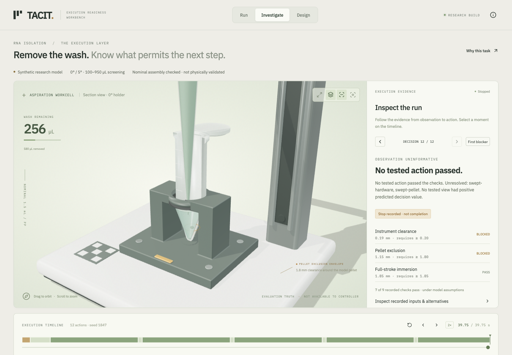

# TACIT

An execution-readiness workbench for one laboratory handling step: bulk wash removal around a modeled RNA pellet. It connects a dimensioned scene, separate synthetic camera evidence, uncertain state estimates, runtime decision receipts and controlled reruns. Research geometry is computationally checked but not for fabrication.

Built by Raaif Bokhari as an independent project exploring scientific execution data and physical AI. It is a synthetic research workbench, not a biological validation study or a robot deployment.

**Local refinement: v0.4.0.** The public links below point to the earlier published version until a separate deployment.

[Open the published workbench](https://tacit-workbench.pages.dev) · [Model and evidence](https://tacit-workbench.pages.dev/docs/methods.html) · [Release review](docs/release-review.md)



## Run locally

Use Node 24 (see `.nvmrc`).

```sh
npm ci
npm run dev
```

Open the printed localhost address. No login, API key, paid service or GPU compute is required. React/TypeScript/Vite power the UI; Three.js renders custom Blender assets. One worker handles interactive computation. Assets and fonts are local.

## Use it

- **Run:** choose a scenario and controller, then run. Space pauses or resumes; R resets the camera.
- **Investigate:** find the first blocker, inspect original check values and inputs, step through decisions, and export/import a hashed evidence packet with exact camera pixels. Legacy traces remain data-only evidence.
- **Design:** rerun a matched pair changing history access, view availability or policy. Inspect either arm and export both. Current exploratory results retain all stops and failures; historical results are separate. Research geometry and older search tools are secondary.

The opening scenario is ready to run. The additional scenarios expose changed setup and missing context. A deliberate stop is different from a completed task. The 10° surface-reference configuration is currently unsupported because one reference calculation failed to converge.

## Reproduce checks

```sh
npm test
npm run build
npm run check:budget
npm run check:calibration
npm run study:readiness
```

Rebuild original meshes with an installed Blender:

```sh
npm run assets
```

On macOS, the asset runner finds `/Applications/Blender.app`. Elsewhere it uses `blender` on PATH. Set `TACIT_BLENDER` to override the executable. Asset generation uses two CPU threads. The app itself does not need Blender installed.

The study command verifies the frozen scientific source hashes before running. Changes to scientific code require a newly versioned study and snapshot; UI-only edits do not invalidate that snapshot.

The current 96-pair exploratory study is in `public/data/readiness-study.json`. It records zero target completions, while readiness increases bulk progress versus fixed + preflight. Its effect estimates and limitations are described in the current methods dossier.

The historical 0.3 GitHub Actions **Held-out controller evaluation** workflow runs the longer experiment in bounded hosted jobs. It uses three optimization seeds per controller, separate training/tuning/evaluation scenes, 512 held-out episodes per primary comparison and a separate 4,096-case geometric stress sample. The generated artifact includes individual episodes and complete-episode outcomes. The published run is [34423472263](https://github.com/raaaaaif/tacit/actions/runs/34423472263). To package its downloaded `held-out-evidence` artifact, run `npx tsx scripts/prepare-evidence.ts <artifact-directory>`; this derives explicit target-attainment counts from recorded final states without rerunning or retuning controllers. Locally, a small diagnostic can use:

```sh
npm run experiment -- --n 6 --controller nominal
```

That command still includes policy search; it is a diagnostic, not the published benchmark. Full batches belong in hosted CI.

Surface Evolver is required only for rebuilding the offline equilibrium reference on Linux:

```sh
python3 scripts/surface_reference.py
```

The separate numerical check uses Python with SciPy:

```sh
npx tsx scripts/numeric-cases.ts
python3 scripts/numerical-check.py
```

The independent Blender image audit can be reproduced with Pillow installed:

```sh
python3 scripts/audit-reference.py
# New frozen nuisance grid, then unchanged feature extractor:
blender --background --python scripts/blender-reference.py -- --extended
python3 scripts/audit-readiness-optics.py
```

## Model and evidence

Read [the methods dossier](docs/methods.md), [walkthrough script](docs/demo-script.md), and [application response draft](docs/application-response.md). The dimension source is [dimensions.json](src/model/dimensions.json). The scene, collision and CAD implementations share those dimensions; the fixture solid is [solid.ts](src/cad/solid.ts).

Physical properties have sources. Labware geometry, wetting, seating accuracy, calibration, material appearance and control margins include explicit research assumptions. The model omits pellet adhesion, near-tip flow and biological outcomes. The independent Blender images expose renderer-dependent measurement error, including missed detections. The fixture has not been fabricated or fit-tested and is not a centrifuge component.

## Static hosting

The production site is `dist/`. Cloudflare Pages build command: `npm run build`; output directory: `dist`; Node version: 24. It requires no server, environment secret or always-on Mac. `_headers` supplies cache and security headers. GitHub Pages can also serve the same static output if configured with the appropriate base path.

No telemetry is installed. All interactive computation and imports run in the viewer's browser.
